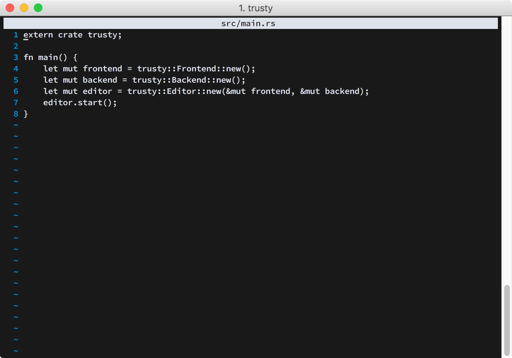

A terminal text editor written in Rust.

## TODO
* Fix unicode issues. Right now the code assumes that each character is exactly 1 byte, which is _wrong_ and will make trusty _panic_ on files that contain multi-byte characters! This is _very bad_!
* Add syntax highlighting.
* Add find-replace.
* Add auto indention.
* Add the ability to edit multiple files.
* Figure out the best way to let end-users extend trusty. (scripts, maybe?)

## Building
trusty uses cargo to build, so just clone the repo and run `cargo build`. You can pass trusty a file on the command line to open it.

## License
I highly doubt that _anyone_ would want to have anything to do with this right now, but if you really want to mess with it, trusty is released under the MIT license.
